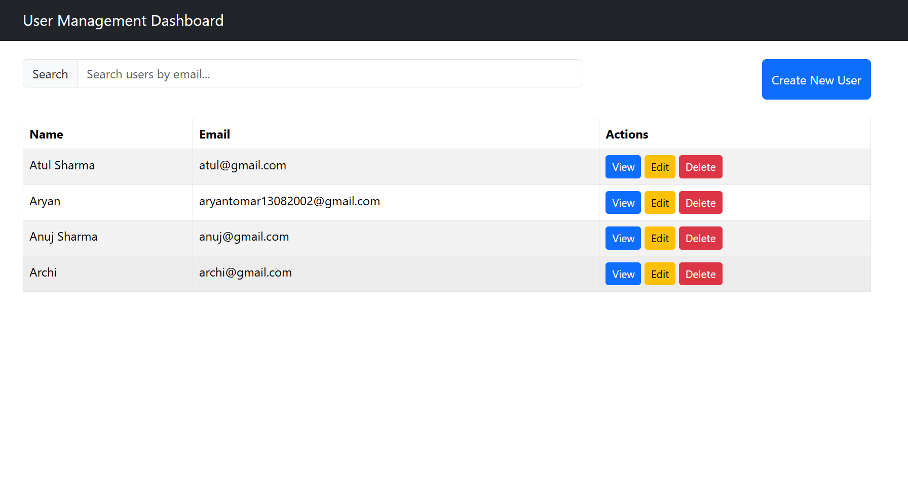
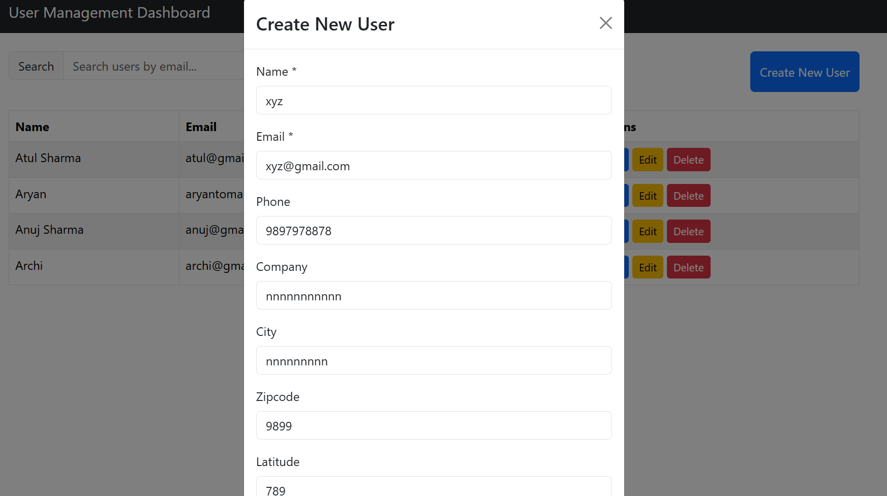
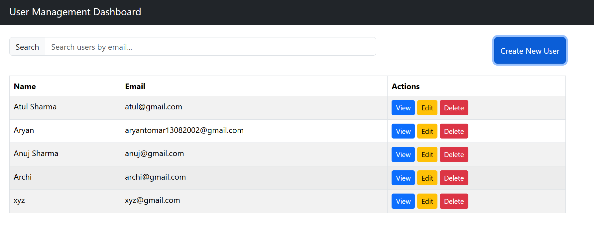
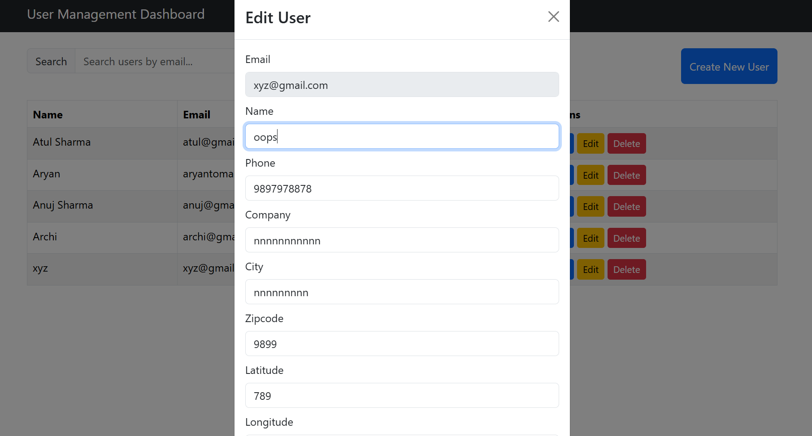
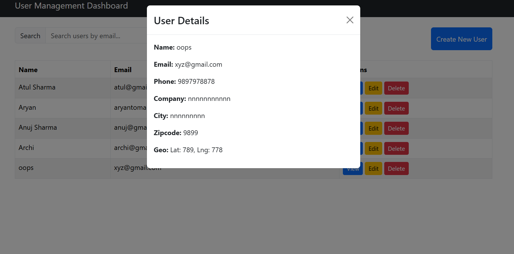
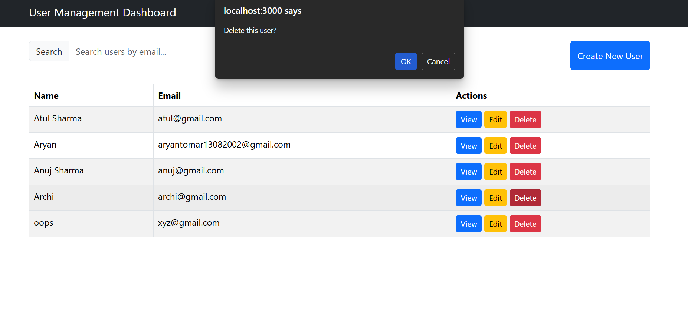
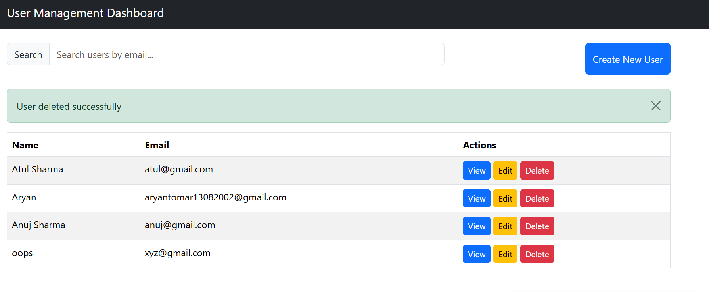

# User Management Dashboard

A full-stack web application for managing users, built with a React frontend and Node.js/Express backend with MongoDB.

## Tech Stack

### Backend
- **Node.js**: JavaScript runtime for server-side development
- **Express.js**: Web framework for Node.js
- **MongoDB**: NoSQL database for data storage
- **Mongoose**: ODM for MongoDB
- **CORS**: Middleware for handling cross-origin requests
- **dotenv**: Environment variable management
- **express-validator**: Middleware for input validation
- **nodemon**: Development tool for auto-restarting the server

### Frontend
- **React**: JavaScript library for building user interfaces
- **Axios**: HTTP client for making API requests
- **Bootstrap**: CSS framework for responsive design
- **React Bootstrap**: Bootstrap components for React
- **Testing Libraries**: Jest and React Testing Library for unit testing

## Prerequisites

Before running this application, ensure you have the following installed:
- **Node.js** (version 14 or higher) - Download from [nodejs.org](https://nodejs.org/)
- **MongoDB** - Install locally or use a cloud service like MongoDB Atlas
- **npm** or **yarn** - Package manager (comes with Node.js)

## Setup Instructions

### 1. Clone the Repository
```bash
git clone <repository-url>
cd user-management-dashboard
```

### 2. Backend Setup
1. Navigate to the backend directory:
   ```bash
   cd backend
   ```

2. Install dependencies:
   ```bash
   npm install
   ```

3. Create a `.env` file in the `backend` directory and add your MongoDB connection string: ex:-
   ```
   MONGO_URI=mongodb://localhost:xxxxxx/user-management
   PORT=5000
   ```

4. Start the backend server:
   ```bash
   npm run dev
   ```
   The backend will run on `http://localhost:5000`.

### 3. Frontend Setup
1. Open a new terminal and navigate to the frontend directory:
   ```bash
   cd frontend
   ```

2. Install dependencies:
   ```bash
   npm install
   ```

3. Start the frontend development server:
   ```bash
   npm start
   ```
   The frontend will run on `http://localhost:3000`.

4. Create a `.env` file in the `frontend` directory and add your backend connection string: ex:-
   ```
   REACT_APP_API_URL=http://localhost:5000/users

### 5. Access the Application
Open your browser and go to `http://localhost:3000` to view the User Management Dashboard.

## Screenshots

1. show all users



2. search user


3. Create user



4.show new user in the list



5. show user details


6. Edit user details



7. show user edit details



8. Delete confirmation message



9. Delete successful message and show updated list




